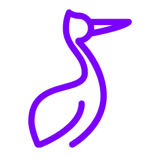

= session
:author: Philip Michael Raab
:email: <philip@cathedral.co.za>
:keywords: inanepain, library, session, secure, remember me
:description: A lightweight, secure and extensible PHP session handling library.
:revnumber: 0.1.0
:revdate: 2025-11-10
:copyright: Unlicense
:experimental:
:hide-uri-scheme:
:icons: font
:source-highlighter: highlight.js
:toc: left
:toclevels: 3
:sectanchors:
:idprefix: topic-
:idseparator: -
:pkg-vendor: inanepain
:pkg-name: session
:pkg-id: {pkg-vendor}/{pkg-name}

==  {pkg-id}

{description}

:sectnums:

<<<

include::./doc/intro.adoc[leveloffset=+1]

<<<

include::./doc/install.adoc[leveloffset=+1]

<<<

include::./doc/quick-start.adoc[leveloffset=+1]

<<<

include::./doc/config.adoc[leveloffset=+1]

<<<

include::./doc/api-ref.adoc[leveloffset=+1]

<<<

include::./doc/examples.adoc[leveloffset=+1]

<<<

include::./doc/security.adoc[leveloffset=+1]
